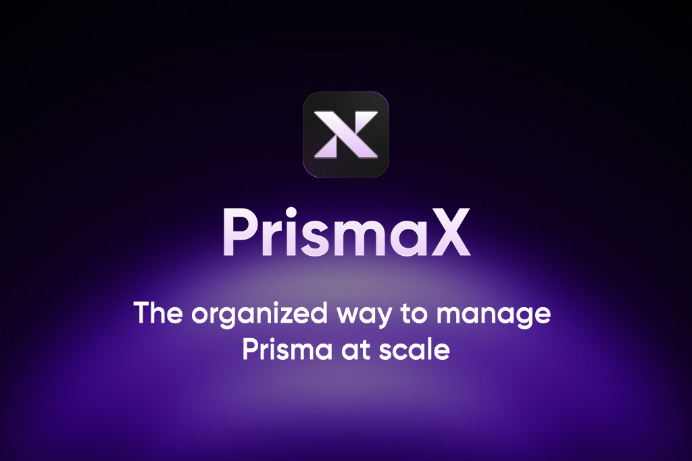

<div align="left">



[](https://www.apple.com/macos/)
[](https://swift.org)
[](https://developer.apple.com/xcode/swiftui/)
[](#license)

# PrismaX

**Run Prisma commands across multiple projects and environments — never swap `.env` files again.**

A native macOS app for managing Prisma workflows across multiple projects and
environments. Built with SwiftUI + SwiftData, with secrets stored in the macOS
Keychain.

</div>

## Why

The Prisma CLI has **no `--env-file` flag** (open request since 2020). Switching
between local/staging/production means swapping `.env` files or wrapping every
command in `dotenv-cli`. PrismaX solves this natively: macOS's `Process` API
accepts a full environment dictionary, so PrismaX pulls the selected
environment's secrets from the Keychain and injects them directly into the
spawned prisma process. `DATABASE_URL` is correct every time — never written to
disk in plaintext.

## Features

- **Multiple projects** — add a project by name + folder; package manager
  (npm/pnpm/yarn/bun) and `schema.prisma` location are auto-detected.
- **Environments per project** — define development / staging / production with
  their own variables. Values live in the macOS Keychain; only keys are stored
  in the app's database.
- **Saved commands** — a sensible default set (`migrate deploy`, `db push`,
  `studio`, `generate`, etc.) is created per project. Run any with one click
  against the selected environment.
- **Guardrails (hybrid model)** — per-environment overrides: *allow* (run
  immediately), *confirm* (require explicit confirmation), or *block*
  (disabled). Stop `migrate dev` from ever running on production.
- **Live terminal output** — commands run inside an integrated real-PTY shell
  (xterm.js), so interactive prompts, colors, and `prisma studio` all work.
- **History & rerun** — every run is persisted (output, exit code, duration).
- **Schema tab** — parses `schema.prisma` (models, enums, generators) and runs
  `prisma migrate status`, showing applied/pending counts.
- **DB backups** — `pg_dump` / `mysqldump` exports with restore and a unified
  restore menu. Backups can be scheduled in the background.
- **.env import** — paste an existing `.env` to onboard an environment in
  seconds.

## Requirements

To **use** the built app:

- **macOS 15 (Sequoia) or later.**
- **Node.js**, on your `PATH` — install via any of:
  - [Homebrew](https://brew.sh): `brew install node`
  - [nvm](https://github.com/nvm-sh/nvm): `nvm install --lts`
  - [fnm](https://github.com/Schniz/fnm) / [Volta](https://volta.sh) / [Bun](https://bun.sh)
- A **package manager** (`npm`, `pnpm`, `yarn`, or `bun`) for the projects you
  manage. PrismaX detects which one a project uses from its lockfile and
  invokes Prisma the way the [Prisma docs][prisma-cli] show:
  `npx prisma`, `pnpm dlx prisma`, `yarn prisma`, or `bunx prisma`.
- A **Prisma project** — a folder containing `prisma/schema.prisma` (or
  `schema.prisma` in a custom location) and a `package.json`.
- For **backups**: the relevant DB CLI on your `PATH` — `pg_dump`/`psql`
  ([Postgres.app](https://postgresapp.com) or `brew install libpq`) or
  `mysqldump`/`mysql`.

> **Note on finding `node`/`npx`:** macOS GUI apps inherit a *minimal* `PATH`
> that doesn't include Homebrew or Node version managers, so a command that
> works in your terminal can show `command not found` in an app. PrismaX
> launches each command through your login shell with common tool locations
> (Homebrew, nvm, fnm, Volta, Bun, Postgres) added to `PATH`, so the tools you
> have installed are found the same way they are in a terminal.

[prisma-cli]: https://www.prisma.io/docs/orm/reference/prisma-cli-reference

## First-time setup (from source)

This is an **[XcodeGen][xcodegen] project**. The `PrismaX.xcodeproj` bundle is
**generated**, not stored in the repo — `project.yml` is the source of truth.
A fresh clone therefore has no `.xcodeproj` until you generate one. This is
intentional and standard for XcodeGen projects: it keeps `project.pbxproj` churn
and merge conflicts out of git history.

### Prerequisites for building

- **macOS 15 (Sequoia) or later.**
- **Xcode 16+** (or the Command Line Tools) — provides `xcodebuild` and `swift`.
- **[XcodeGen][xcodegen]** — `brew install xcodegen`

### Build

The easiest way is the included distribution script, which renders the icon,
generates the Xcode project, builds a Release `.app`, and packages a `.dmg`
into `./dist`:

```bash
./build.sh                 # → dist/PrismaX.app + dist/PrismaX-1.0.dmg
./build.sh --no-dmg        # just the .app
./build.sh --clean         # rebuild from scratch
```

This produces an **ad-hoc signed, un-notarized** build suitable for sharing
without an Apple Developer account. Recipients will see a Gatekeeper warning on
first launch — to open it: **right-click the app → Open → Open** (or *System
Settings → Privacy & Security → Open Anyway*).

### Manual build

If you'd rather open the project in Xcode, **generate the project first** (this
step is required — the `.xcodeproj` is not in the repo):

```bash
# 1. Generate the Xcode project from project.yml (one-time, or after editing it)
xcodegen generate

# 2. Open and run
open PrismaX.xcodeproj
```

Or build from the command line after generating:

```bash
xcodebuild -project PrismaX.xcodeproj -scheme PrismaX -configuration Release build
```

The built app lands in `~/Library/Developer/Xcode/DerivedData/...`. Run it from
there, or copy it to `/Applications`.

> After editing `project.yml` (adding a source file, changing settings, etc.),
> re-run `xcodegen generate`. The build script does this automatically.

### App icon

Place a high-resolution icon (1024×1024 PNG) at `icons/1024.png`. The build
script automatically generates all required sizes from this source. To
regenerate icons:

```bash
./scripts/generate_icons.sh icons/1024.png
```

This writes all sizes into `PrismaX/Resources/Assets.xcassets/AppIcon.appiconset`,
which the build picks up via the asset catalog. The build script runs this
automatically unless you use `--no-icon`.

## Architecture

```
PrismaX/
├── models/         SwiftData @Model classes (Project, Environment, Command, …)
├── services/       RunService, TerminalManager, SchemaService, BackupService,
│                   ShellRunner, KeychainService, …
└── views/          SwiftUI views (NavigationSplitView shell + tabs)
```

### Core mechanism

Commands run inside an **integrated terminal** (a real PTY shell rendered with
xterm.js), so they behave exactly like your own shell — interactive prompts,
colors, and `prisma studio` all work. The run flow:

1. `RunService.run()` builds the invocation via `PrismaCommandBuilder`, which
   resolves the prisma executable from the detected package manager
   (`npx prisma`, `pnpm dlx prisma`, `yarn prisma`, `bunx prisma`) and
   appends `--schema` (relativized to the command dir) when needed.
2. `TerminalManager` dispatches it into the project's shell. Before the shell
   starts, `EnvironmentResolver` overlays the selected environment's secrets —
   read from the macOS Keychain (and an optional `.env` file) — onto the
   process environment. `DATABASE_URL` is correct every time.
3. Switching the active environment restarts the shell so the new env's
   secrets take effect.
4. Every dispatch is recorded as a `RunRecord` (History), so runs can be
   inspected and re-dispatched later.

Secrets never touch disk in plaintext.

[xcodegen]: https://github.com/yonaskolb/XcodeGen

## Roadmap

- [x] v1 core: projects, environments, saved commands, live output, guardrails, history
- [x] DB backups (`pg_dump` / `mysqldump`) with restore and in-app scheduling
- [x] Live schema introspection (`schema.prisma` parser + `prisma migrate status`)
- [ ] Background scheduled backups via a LaunchAgent (currently runs only while PrismaX is open)
- [ ] Code signing & Sparkle auto-update for distribution

## License

Copyright (c) 2026 PrismaX. All rights reserved.
